.. _using:

Usando o Novo SGA
==================

Depois de instalar o Novo SGA é hora de configurar os serviços e a(s) unidade(s).

Funcionamento
-------------

Quando um novo cliente chega à unidade de atendimento, ele passa pela triagem para definir qual serviço deseja ser atendido e se é um atendimento prioritário ou não.

Com o novo atendimento gerado, e de posse da senha, o cliente aguarda pela exibição de sua senha no painel. Esse evento (chamar a senha) é invocado pelo atendente que atende o serviço escolhido na triagem.

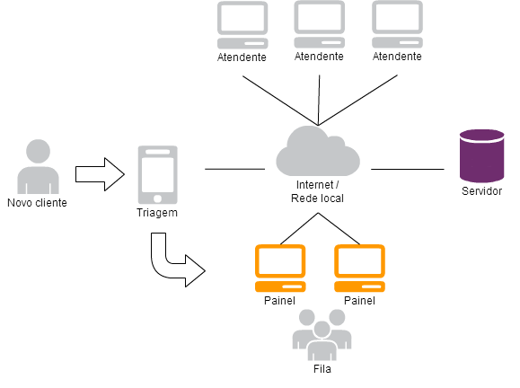

    Fluxo de funcionamento do Novo SGA

A senha é formada por um número incremental (único na unidade) prefixada da letra do serviço. No caso do serviço identificado pela letra 'A', a primeira senha gerada na unidade para esse serviço será a senha 'A0001', já a segunda senha gerada (desta vez para o serviço 'B') será 'B0002'.

Caso aconteça um erro na triagem e o serviço definido não for realmente o que o cliente deseja, o próprio atendente pode redirecioná-lo para outro serviço mantendo sua senha com o mesmo número, evitando que o cliente caia no final da fila do novo serviço.

Ao final do atendimento o sistema terá computado a hora de cada estado do atendimento, sendo possível saber: O tempo de deslocamento do cliente até o atendente, o tempo do atendimento, e o tempo total de permanência do cliente na unidade até ser atendido.

Novo SGA Web
-------------

É na parte web que está concentrada a grande parte das funcionalidades do Novo SGA, indo desde a configuração do sistema até o atendimento ao cliente. Estas funcionalidades estão dividas em módulos para facilitar a customização de acessso e permissões.

Cada módulo possui um agrupamento de funções, são dinâmicos, e estão acessíveis de acordo com o nível de acesso do usuário do sistema (permissão). Tais módulos são divididos em dois tipos: Módulos Globais e Módulos Locais. Abaixo segue uma descrição os módulos padrões (pré-instalados) do Novo SGA.

Módulos Globais
~~~~~~~~~~~~~~~

Os módulos globais são aqueles que afetam todas as unidades, ou que por algum motivo não tem relação com nenhuma unidade em particular.

Administração
..............

Módulo de configurações globais do sistema. 

Na aba **Sistema** pode definir o tipo de autenticação do sistema, se apenas pelo banco de dados ou via LDAP e banco de dados (em caso de falha do primeiro). Na aba **Triagem** pode reiniciar a contagem das senhas e visualiza a URL que pode ser utilizada caso queira criar um cron para reinício automático das senhas.

Já na aba **Painéis**, visualiza todos os painéis cadastrados no servidor de painel, de todas as unidades.

.. warning::
    O botão para reiniciar senha no módulo Administração, reinicia a contagem das senhas de todas as unidades. Então antes usar essa opção, certifique-se que ainda não foram gerados atendimentos no dia para todas as unidades.

Prioridades
............

Para efeitos estatísticos, pode-se catalogar os atendimentos prioritários. Definindo uma descriçao e um peso que influencia na ordem da fila (quanto maior o peso mais rápido será atendido).

Serviços
........

Cadastro de todos os serviços atendidos pela a organização. Todos os serviços devem ser definidos nesse cadastro e só depois habilitados ou não para serem exibidos na unidade (módulo de configuração da unidade).

Os serviços são dividos em macroserviços e subserviços para facilitar a geração das senhas. Apenas os macroserviços são exibidos na tela da triagem, porém ao atendente concluir o seu atendimento aparecerão todos os serviços (macros e subs) para escolher quais foram os serviços efetudas.

Grupos
........

Cadastro para criar a estrutura hierárquica das unidades de atendimento. Os grupos podem refletir a distribuição geográfica da organização.

Pode-se criar grupos e subgrupos por estados, por municípios, regiões, gerências etc. Cada unidade será lotada num grupo final (grupo de mais baixo nível, também conhecido como grupo-folha). Um grupo final pode ter nenhuma ou uma unidade. Usuários poderão ser lotados em grupos finais, intermediários ou no próprio grupo raiz.

.. important::
    O grupo raiz ('Raiz') não pode ser removido, apenas editado

Unidades
........

Cadastro das unidades de atendimento da organização. Ideal para grandes organizações que podem manter o sistema centralizado em um servidor e distribuir os pontos de acessos em locais distintos. No caso de uma prefeitura por exemplo, pode ter vários postos de atendimentos (unidades) conectados a um mesmo servidor (via Internet ou uma rede metropolina).

.. important::
    Toda unidade deve estar vinculada a um grupo folha (último nível), e caso o grupo que unidade esteja associada receba um novo filho, a unidade passará a estar vinculada a esse novo grupo folha.

Cargos
......

Cadastro da hierarquia de cargos seguindo a estrutura de árvore. As permissões de acesso aos módulos são definidas em cada cargo.

.. important::
    O cargo raiz ('Administrador') não pode ser removido, apenas editado

Usuários
.........

Cadastro dos usuários do sistema: atendentes, responsáveis pela triagem, gerentes e administradores.

Os usuários podem possuir acesso a mais de uma unidade através das lotações. A lotação é o par de grupo e cargo, o que irá definir o acesso do usuário aos módulos do sistema em cada unidade. 

.. important::
    Se o usuário for lotado em um grupo raiz (ou não folha) automaticamente terá acesso a todas as unidades vinculadas aos nós folha desse grupo com o cargo dessa lotação.

Estatísticas
.............

Neste módulo, o usuário terá acesso a todos os relatórios, gráficos e estatísticas de atendimentos registrados no sitema. O Novo SGA permite que sejam gerados relatórios, estatísticas e gráficos de uma ou mais unidades, de modo a apresentar a informação que a organização necessita para otimizar seu atendimento.

Módulos Locais
~~~~~~~~~~~~~~~

Nos módulos Locais estão os módulos específicos de cada unidade. Estes só estarão visíveis quando o usuário logar em uma unidade, e as configurações afetarão apenas esta
unidade.

Unidade
.......

Módulo de configuração da unidade atual (unidade escolhida após login).

Nesse módulo que define as configurações da triagem, como impressão e mensagens das senhas, reinício da contagem das senhas, e quais serviços estão habilitados para a unidade e quais as letras de cada um. Além de visualizar os painéis que estão exibindo senhas dessa unidade.

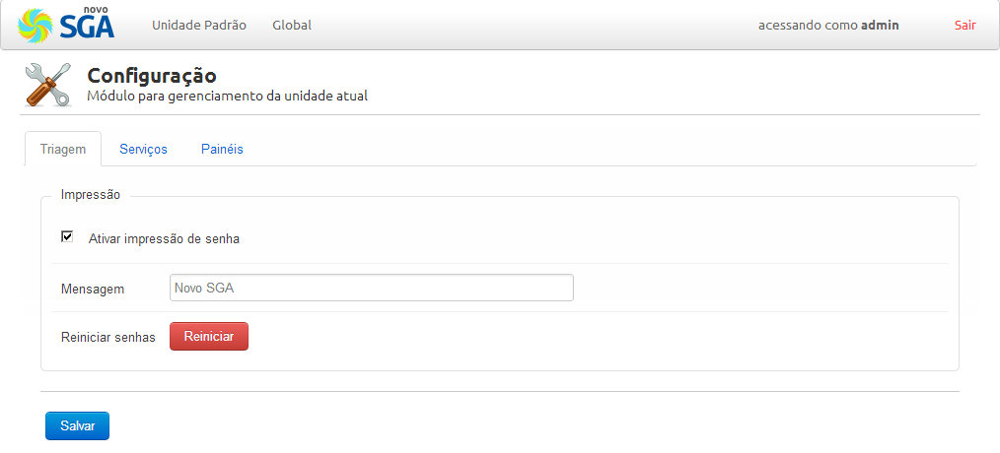

    Configuração da unidade - Triagem

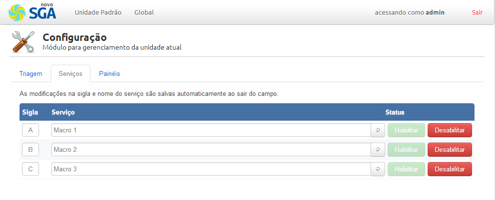

    Configuração da unidade - Serviços

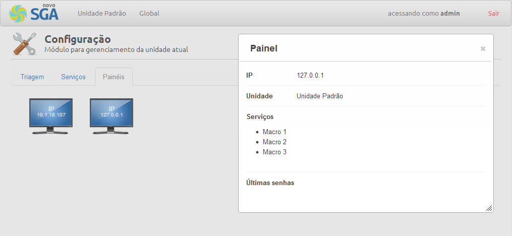

    Configuração da unidade - Painéis

Triagem
........

É o módulo de pré-atendimento. Nele, é possível  emitir senhas para os serviços e filas específicas, e realizar impressão  das mesmas. É possível emitir senhas com prioridade e com identificação do cliente. Também é possível cancelar e reativar senhas.

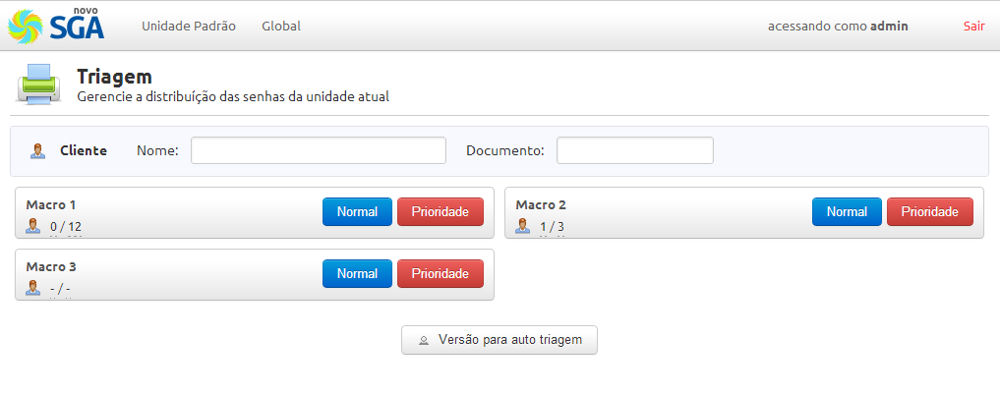

    Triagem - Tela inicial

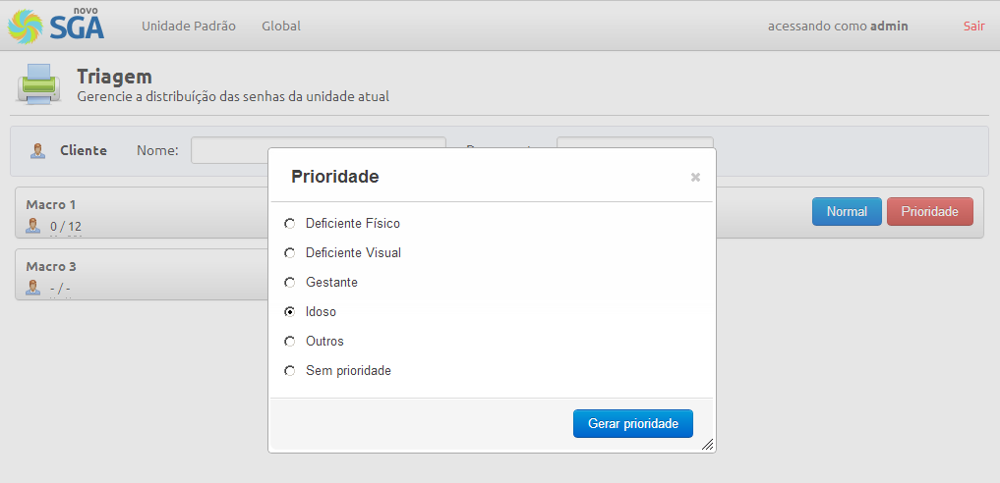

    Triagem - Atendimento prioritário

Atendimento
............ 

Contém todas as funcionalidades para efetuar atendimentos em um guichê. Com menus intuitivos e práticos o SGA propicia facilidade e rapidez nos
atendimentos.

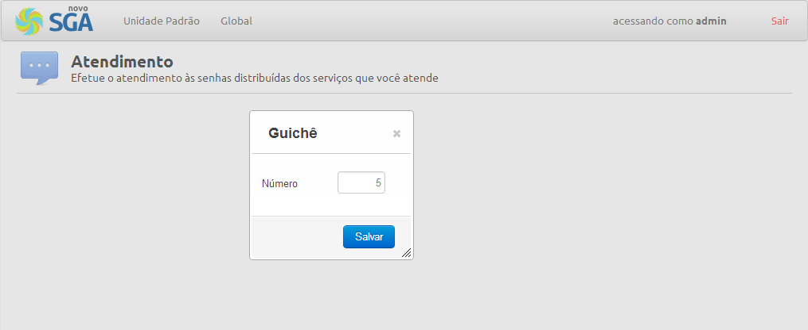

    Atendimento - Definindo número do guichê

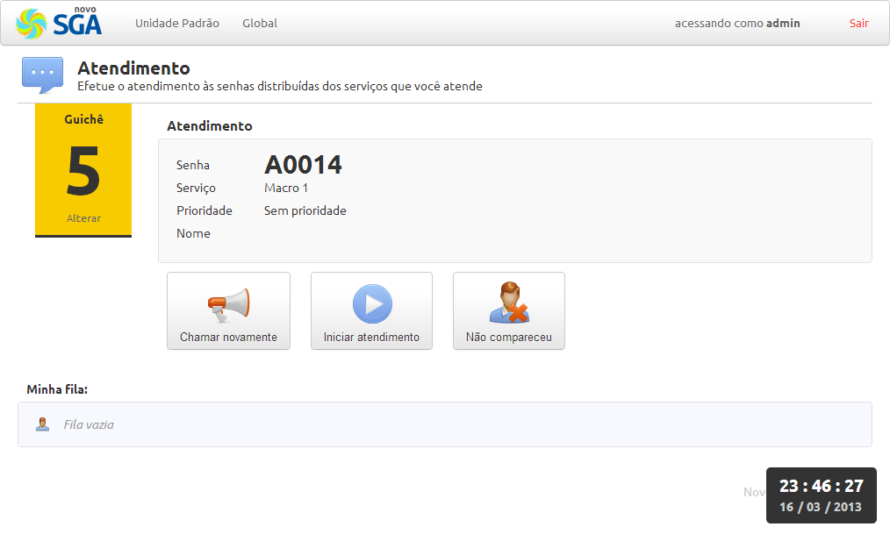

    Atendimento - Iniciar atendimento

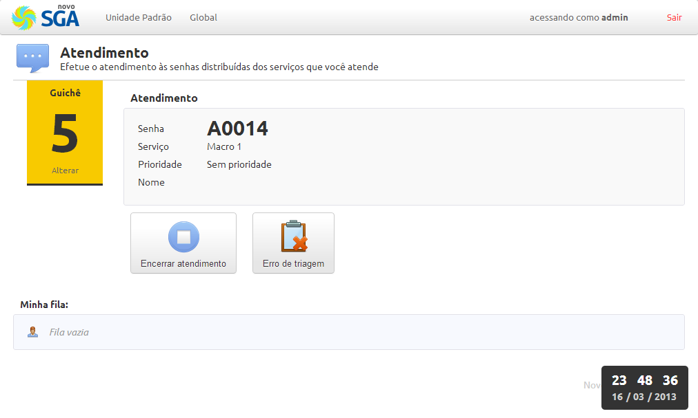

    Atendimento - Atendimento iniciado

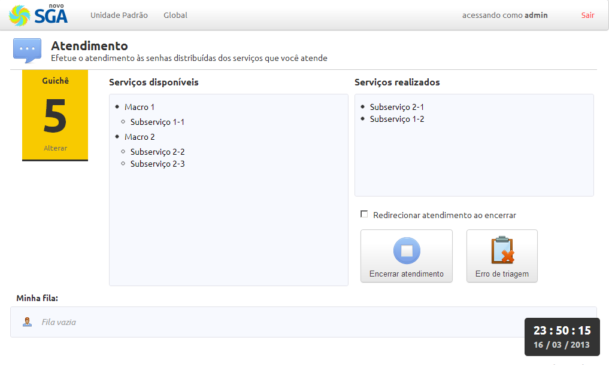

    Atendimento - Encerrando atendimento

Monitor
.......

Módulo gerencial que permite o acompanhamento em tempo real de toda a unidade de atendimento. É possível visualizar todas as filas de atendimento detalhadamente, movimentar cliente de uma fila para outra, priorizar, cancelar e reativar senhas.

Painel Cliente
--------------

Na primeira vez que executar o painel cliente, é necessário informar a endereço do servidor (IP ou nome) que está executando o servidor de painéis. Depois ao clicar no botão **Buscar unidades**, preencherá o menu com todas as unidades cadastradas no sistema. E após selecionar a unidade, abaixo carregará todos os serviços atendidos na unidade selecionada.

Uma vez marcados os serviços que deseja que sejam chamados nesse painel, basta clicar no botão **Salvar** e aguardar o atendente (que atende um dos serviços marcados) chamar o próximo da fila.

Na aba **Aparência**, pode configurar desde as cores do painel, vocalização de senhas e exibição de filme quando o painel ocioso.

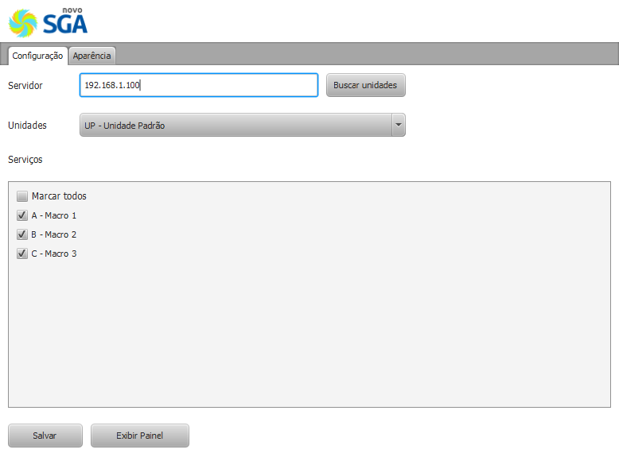

    Painel - Configuração

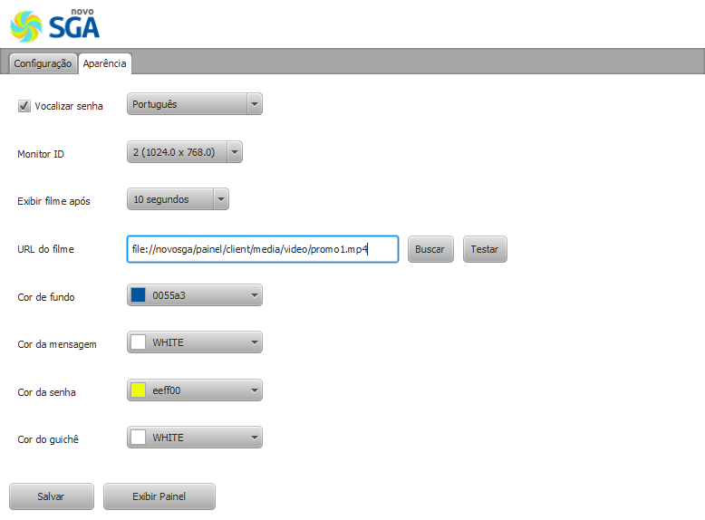

    Painel - Aparência

.. important::
    Para ocultar o painel (exibição de senhas), basta clicar com o botão do meio do mouse (roda/scroll).